# 记忆进化系统详细流程图与审计结果

> 审计日期：2026-08-07  
> 中文产品名：**记忆进化系统**  
> 适用版本：2.0.12  
> 说明：图中统一使用中文业务名称；源码标识符只在术语表和审计证据中保留。

## 一、审计结论

近期修复覆盖的分层记忆、检索、技能演化和数据迁移逻辑整体可用：严格类型检查通过，18 个单元测试文件中的 38 个用例全部通过，数据库结构版本已到 14，数据库快速完整性检查正常，全文索引数量与主表一致，未发现孤立外键或经验策略支持度漂移。

本轮检查确认了 3 项问题，现均已在本机源码和运行产物中修复。

| 等级 | 问题 | 本地处理 | 验证结果 |
|---|---|---|---|
| 高 | 两套通信桥入口功能不同步 | 已把运行域参数、无界面通信桥清理、动态档案、配置化日志、进程探测和限时关闭同步到纯模块入口，并重新生成两种本地运行产物 | 两个入口分别在隔离目录完成启动、14 级迁移、关闭和运行域进程文件清理；新增入口一致性测试 |
| 中 | 进程探测表达式不兼容系统命令 | 系统命令只做兼容的宽范围候选查询，再由程序内表达式判断完整命令行 | 不再产生系统正则错误；四个进程识别测试通过 |
| 中 | 专用模型重试次数配置被忽略 | 配置结构、默认值、运行类型和两个模型客户端均接入最大重试次数 | 本地配置正确读取两项值为 2，无未知字段告警；三个配置测试通过 |

### 已执行的本地修复

1. 同步两套通信桥的启动与关闭防护，并建立入口能力一致性测试。
2. 用“宽范围列出候选进程，再在程序内解析命令行”的方式替代系统命令中的复杂表达式。
3. 在专用模型配置结构、默认值和启动参数中统一加入“最大重试次数”，并增加配置解析测试。
4. 使用当前安装目录可用的 TypeScript 配置重新生成本地 `dist`，不执行发布或打包。

### 已通过的检查

| 检查项 | 结果 |
|---|---|
| 严格类型检查 | 通过，无错误 |
| 单元测试 | 18 个测试文件、38 个用例全部通过 |
| 赫尔墨斯清单版本 | 与包版本 2.0.12 一致 |
| 数据库快速完整性 | 正常 |
| 外键关系 | 会话、任务片段、行动轨迹、技能试运行、轨迹—策略关联均无孤立记录 |
| 全文索引 | 行动轨迹 1661/1661、经验策略 115/115、世界模型 3/3，主表与索引一致 |
| 策略支持度 | 115 条经验策略的存储支持度均等于关联任务片段去重计数 |
| 演化元数据 | 策略、技能和世界模型无空指纹；无旧版本待决试运行 |
| 数据迁移预演 | 不建议新增策略状态变更；无待归档候选技能；世界模型当前状态与预演一致 |
| 本地运行产物 | 已使用现有 TypeScript 配置重新生成；纯模块与通用模块通信桥冒烟测试均通过。未执行发布或打包 |

### 审计边界

当前目录不是版本控制工作树，无法把问题精确归因到某次提交。本轮审计依据当前源码、当前构建产物、现有单元测试和只读运行数据；目录内没有集成测试或端到端测试，因此通信桥、主机适配器与真实模型服务之间的完整链路仍需要在完整源码仓库中补测。外部模型服务的限流和超时告警不计为本地代码缺陷。`daemon_manager.py` 中的 `_rebuild_if_stale()` 当前没有调用方，所以缺少完整构建配置不会在重启时触发自动重建；它属于可清理的死代码或未完成能力，不是当前高危运行故障。

## 二、系统总览

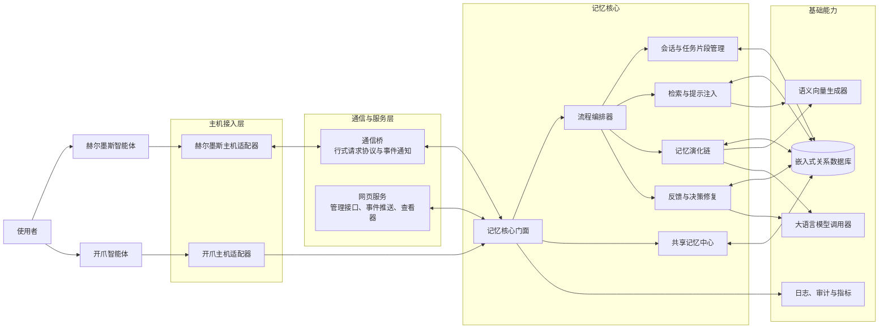

核心原则是：主机适配器只负责翻译宿主事件；会话、捕获、回报、分层演化、检索和持久化均由记忆核心统一完成。

## 三、一次对话从进入到形成长期记忆

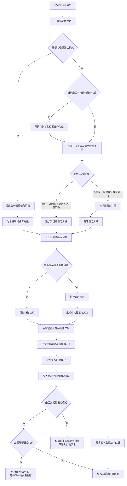

注意：普通模式不是“每轮都做完整反思”。每轮只先写入可检索的事实轨迹；当主题真正结束时，才对整个任务片段统一反思、评分和演化。

## 四、主题结束后的写入与演化链

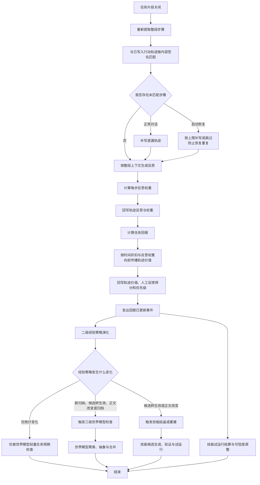

### 轨迹价值传播

系统先得到整个任务片段的任务回报，再从后向前计算每条行动轨迹的价值。可理解为：越靠近最终结果、反思越明确的步骤获得越直接的信用；较早步骤按折扣系数继承后续结果。检索优先级还会随时间衰减，避免很久以前的普通记忆长期压过新证据。

## 五、二级经验策略的形成与状态变化

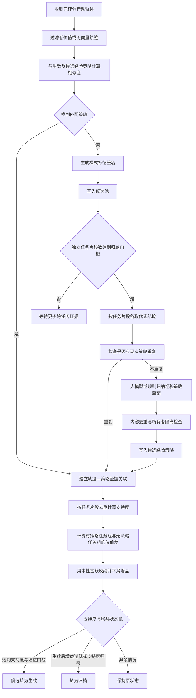

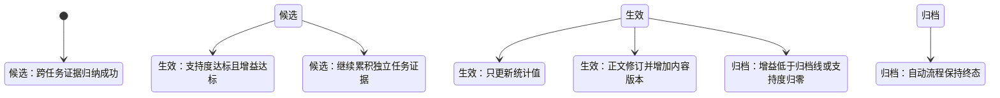

关键约束：支持度统计的是独立任务片段数量，不是行动轨迹条数；同一任务片段产生二十条轨迹，也只贡献一次支持。

## 六、三级世界模型的形成与生命周期

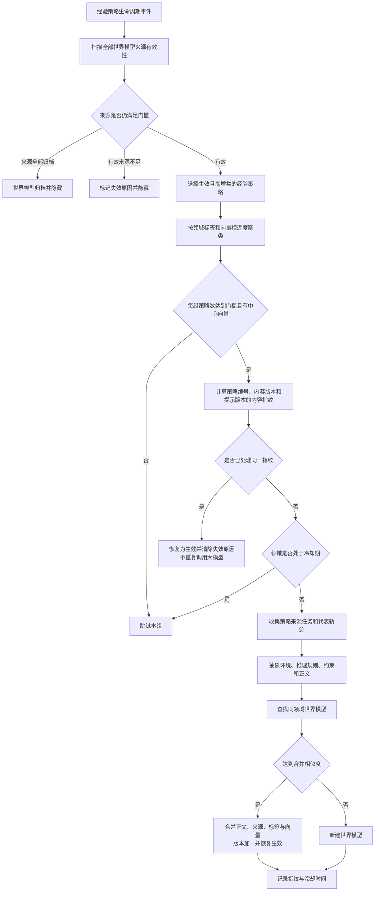

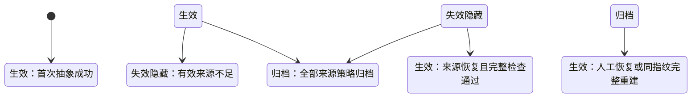

世界模型的“失效隐藏”不是数据库状态字段的第三种值，而是“仍为生效状态但带有失效原因”。所有向量、全文和短语检索通道都会排除带失效原因的记录。

## 七、可执行技能的结晶、试运行与影子升级

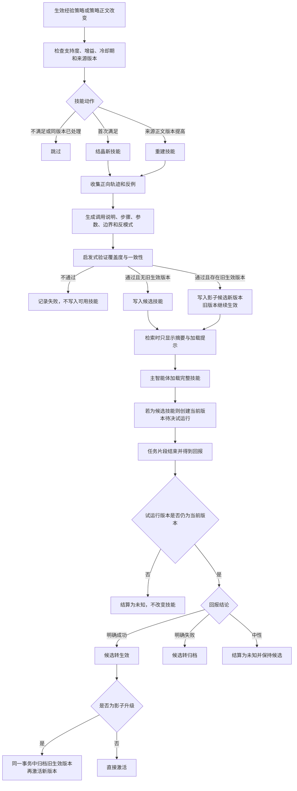

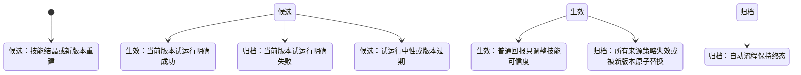

关键约束：候选技能最多保留两个进入最终排序，不预留固定名额；候选技能即使配置为完整注入，也只能展示摘要，必须由主智能体主动加载后才会创建试运行。

## 八、详细检索与提示注入流程

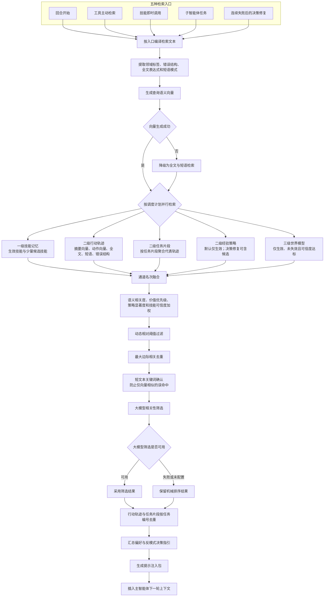

### 各入口默认读取层级

| 中文入口 | 默认读取 | 特殊行为 |
|---|---|---|
| 回合开始 | 一级技能、二级轨迹/任务/经验、三级世界模型 | 完整检索；普通模式排除当前会话轨迹 |
| 工具主动检索 | 二级与三级 | 可由调用方显式加入一级 |
| 技能即时调用 | 一级与少量二级 | 重点加载目标技能的即时上下文 |
| 子智能体任务 | 二级与三级 | 不读取一级技能，减少主智能体技能污染 |
| 连续失败后的决策修复 | 一级与二级 | 包含低价值反例和候选经验策略，不读取三级 |
| 轻量记忆模式 | 仅二级事实轨迹 | 关闭经验策略、世界模型、技能和反馈演化 |

## 九、连续工具失败与显式反馈

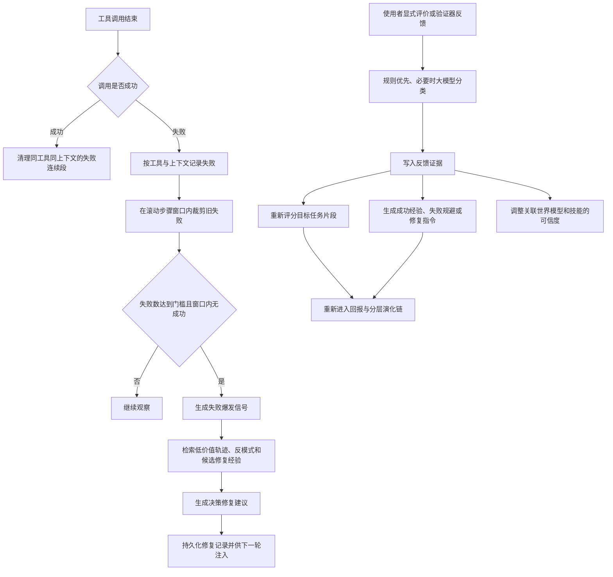

## 十、启动、恢复与关闭

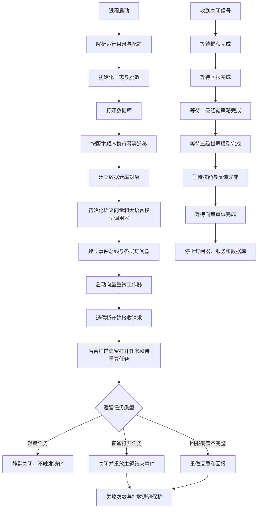

## 十一、统一中文术语表

下表为流程图、界面和后续中文文档建议采用的标准名称。代码标识符保持不变，中文名用于解释与展示。

### 架构与通信

| 原英文名词或标识符 | 统一中文名词 | 含义 |
|---|---|---|
| PigMemory | 记忆进化系统 | 本项目整体 |
| Hermes | 赫尔墨斯智能体 | 赫尔墨斯宿主 |
| OpenClaw | 开爪智能体 | 开爪宿主 |
| Adapter | 主机适配器 | 把宿主事件翻译为核心调用 |
| Bridge | 通信桥 | 主机与记忆核心之间的进程通信层 |
| Core | 记忆核心 | 与宿主无关的统一业务核心 |
| Server | 网页服务 | 管理接口、事件推送和查看器服务 |
| Viewer | 记忆查看器 | 浏览和维护记忆的网页界面 |
| JSON-RPC | 行式请求协议 | 通信桥使用的请求、响应与通知协议 |
| HTTP | 网页请求协议 | 网页管理接口协议 |
| SSE | 单向事件推送 | 服务端向查看器持续推送事件 |
| DTO | 数据传输对象 | 跨模块或跨进程的数据结构 |
| Event Bus | 事件总线 | 模块之间的异步事件分发机制 |
| Subscriber | 事件订阅器 | 监听上游事件并启动下一阶段 |
| Pipeline | 流程编排器 | 统一调度会话、捕获、回报、演化和检索 |
| Repository | 数据仓库对象 | 封装数据库表读写 |
| Namespace | 所有者命名域 | 隔离不同智能体、档案和工作区的数据 |
| Runtime Scope | 运行域 | 隔离不同运行目录的进程所有权 |
| Daemon | 守护进程 | 长期运行的查看器服务进程 |
| Bootstrap | 启动装配 | 建立配置、数据库、模型和流程对象 |
| Migration | 数据迁移 | 按版本升级数据库结构与元数据 |
| Telemetry | 匿名运行遥测 | 发送匿名运行指标与错误分类 |
| Audit Log | 审计日志 | 记录重要管理与数据变更 |

### 记忆与演化

| 原英文名词或标识符 | 统一中文名词 | 含义 |
|---|---|---|
| Session | 会话 | 同一主机聊天上下文的长期容器 |
| Episode | 任务片段 | 一个连续主题或子任务的完整过程 |
| Turn | 对话轮 | 一次使用者消息与智能体处理 |
| Trace | 行动轨迹 | 一级事实记忆中的状态、动作和结果记录 |
| L1 Memory | 一级事实记忆 | 原始会话事实与行动轨迹 |
| L2 Policy | 二级经验策略 | 从多个独立任务归纳出的可复用做法 |
| L3 World Model | 三级世界模型 | 跨经验策略抽象出的环境规律与约束 |
| Policy | 经验策略 | 触发条件、步骤、验证、边界和决策指引 |
| World Model | 世界模型 | 环境实体、推理规则、约束和正文 |
| Skill | 可执行技能 | 可由主智能体加载执行的结构化操作指南 |
| Candidate Pool | 归纳候选池 | 暂存尚未达到跨任务归纳门槛的轨迹 |
| Pattern Signature | 模式特征签名 | 对相似失败或做法分桶的稳定特征 |
| Association | 证据关联 | 把行动轨迹连接到经验策略 |
| Induction | 经验归纳 | 从多任务证据生成经验策略 |
| Abstraction | 世界抽象 | 从多条经验策略生成世界模型 |
| Crystallization | 技能结晶 | 从生效经验策略生成可执行技能 |
| Reflection | 过程反思 | 对步骤作用、错误和改进方式的总结 |
| Alpha | 反思权重 | 某步反思对信用分配的可信程度 |
| Reward | 任务回报 | 对整个任务片段结果的评分 |
| Human Reward | 人工反馈得分 | 使用者或验证信号形成的回报 |
| Trace Value | 轨迹价值 | 回报向前传播后每条轨迹获得的价值 |
| Backpropagation | 价值回传 | 按反思权重与折扣系数向前分配任务回报 |
| Support | 支持度 | 支持某经验策略的独立任务片段数量 |
| Gain | 增益 | 使用某经验策略与未使用时的价值差 |
| Eta | 技能可信度 | 技能在策略证据和试运行下的可靠程度 |
| Evidence Anchor | 证据锚点 | 技能或策略关联的来源轨迹编号 |
| Content Version | 内容版本 | 经验策略正文发生实质变化的版本号 |
| Trial Version | 试运行版本 | 允许影响当前技能状态的版本号 |
| Shadow Candidate | 影子候选版本 | 旧版本继续生效时等待验证的新版本 |
| Fingerprint | 内容指纹 | 用于幂等、重复检测的稳定摘要 |
| Cooldown | 冷却期 | 避免相同领域频繁重复抽象的时间窗口 |

### 状态与反馈

| 原英文名词或标识符 | 统一中文名词 | 含义 |
|---|---|---|
| Candidate | 候选 | 已生成但尚未满足生效条件 |
| Active | 生效 | 可以进入正常检索或调用 |
| Archived | 归档 | 自动流程不再使用的历史记录 |
| Stale | 失效隐藏 | 来源不足，保留记录但不参与检索 |
| Pending Trial | 待决试运行 | 已加载候选技能，等待任务结果 |
| Pass | 明确成功 | 当前版本试运行通过 |
| Fail | 明确失败 | 当前版本试运行失败 |
| Unknown | 结论未知 | 中性回报或试运行版本已过期 |
| Feedback | 使用者反馈 | 显式评价、验证意见或修正 |
| Decision Repair | 决策修复 | 根据连续失败生成的下一步纠偏建议 |
| Failure Burst | 连续失败信号 | 同工具同上下文在窗口内达到失败门槛 |
| Preference | 推荐做法 | 检索时注入的优先选择 |
| Anti-pattern | 反模式 | 应避免的历史错误做法 |
| Lifecycle | 生命周期 | 候选、生效、归档与失效之间的变化规则 |

### 检索与模型

| 原英文名词或标识符 | 统一中文名词 | 含义 |
|---|---|---|
| Retrieval | 记忆检索 | 按当前任务找回相关历史证据 |
| Injection | 提示注入 | 把检索结果加入主智能体上下文 |
| Injection Packet | 提示注入包 | 排序、裁剪并渲染后的记忆集合 |
| Embedding | 语义向量生成 | 把文本转换为可比较的数值向量 |
| Vector | 语义向量 | 表示文本语义位置的数值数组 |
| Cosine Similarity | 余弦相似度 | 比较两个语义向量的接近程度 |
| Full-text Search | 全文检索 | 使用倒排索引查找文字命中 |
| Pattern Search | 短语模式检索 | 处理双字中文和过短词语的子串检索 |
| Structural Match | 错误结构匹配 | 按错误签名查找相同故障形态 |
| Reciprocal Rank Fusion | 倒数名次融合 | 合并多个检索通道的排名证据 |
| Maximum Marginal Relevance | 最大边际相关去重 | 在相关性与结果多样性间取平衡 |
| Ranker | 综合排序器 | 统一计算跨层候选的最终顺序 |
| Relative Threshold | 动态相对阈值 | 根据本次最高相关度确定保留下限 |
| Deduplication | 结果去重 | 合并同任务或高度重复的候选 |
| Large Language Model | 大语言模型 | 用于反思、归纳、抽象、结晶和相关性筛选 |
| Model Filter | 大模型相关性筛选 | 对机械检索结果做语义级最终裁剪 |
| Fallback | 降级后备 | 主能力不可用时切换到可用路径 |
| Retry Queue | 向量重试队列 | 异步补写生成失败的语义向量 |
| Lightweight Memory | 轻量记忆模式 | 只保留事实轨迹和检索，关闭自我演化 |

## 十二、实现不变量清单

后续修改应至少保持以下不变量：

1. 同一任务片段对同一经验策略最多贡献一次支持度。
2. 候选经验策略默认不进入普通检索，只能在决策修复或显式请求时出现。
3. 候选技能只能摘要展示，不能绕过主动加载直接完整注入。
4. 旧版本技能试运行不得改变新版本技能状态。
5. 影子技能通过后，旧版本归档与新版本激活必须在同一数据库事务中完成。
6. 世界模型只有在生效、无失效原因且可信度达标时才允许被任一检索通道返回。
7. 同一策略内容指纹不得重复调用世界抽象模型。
8. 统计值变化不得错误增加经验策略内容版本。
9. 轻量记忆模式不得触发回报、经验策略、世界模型、技能或反馈演化。
10. 通信桥的不同模块格式入口必须具备相同的进程隔离、档案解析、日志初始化和关闭语义。
