# PigMemory 原理图集

先用 4 张独立公式图理解核心评分，再按当前源码的实际执行顺序阅读 12 张流程图。Viewer 直接展示浅色 SVG，点击图片可无限放大；同目录的 PNG 用于文档预览。

## 核心公式图解

[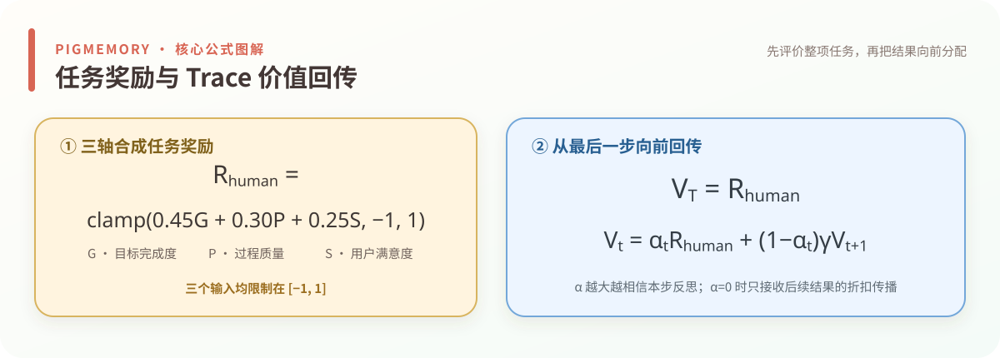](../viewer/public/assets/pigmemory-guide/formula-reward-value.svg)

[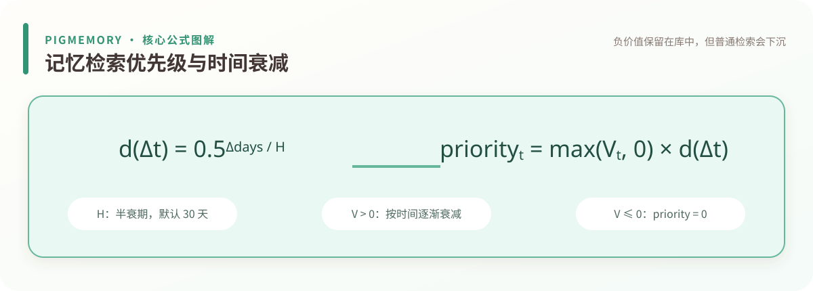](../viewer/public/assets/pigmemory-guide/formula-priority.svg)

[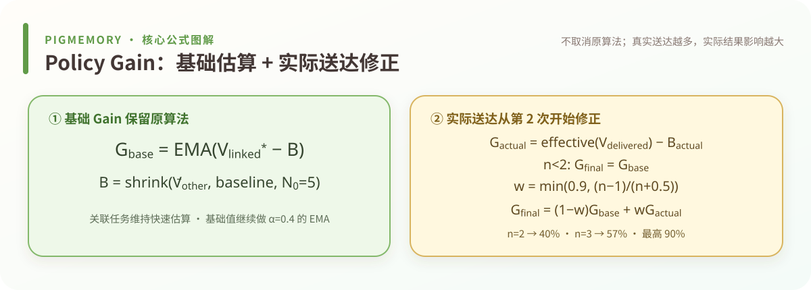](../viewer/public/assets/pigmemory-guide/formula-policy-gain.svg)

[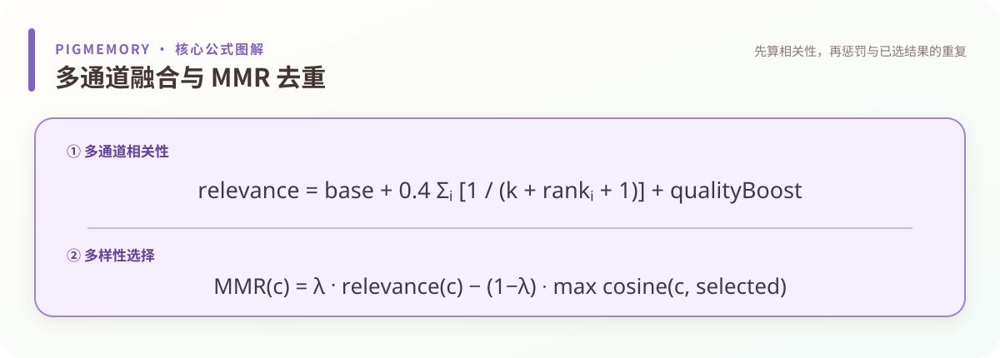](../viewer/public/assets/pigmemory-guide/formula-retrieval-ranking.svg)

## 原理流程图

[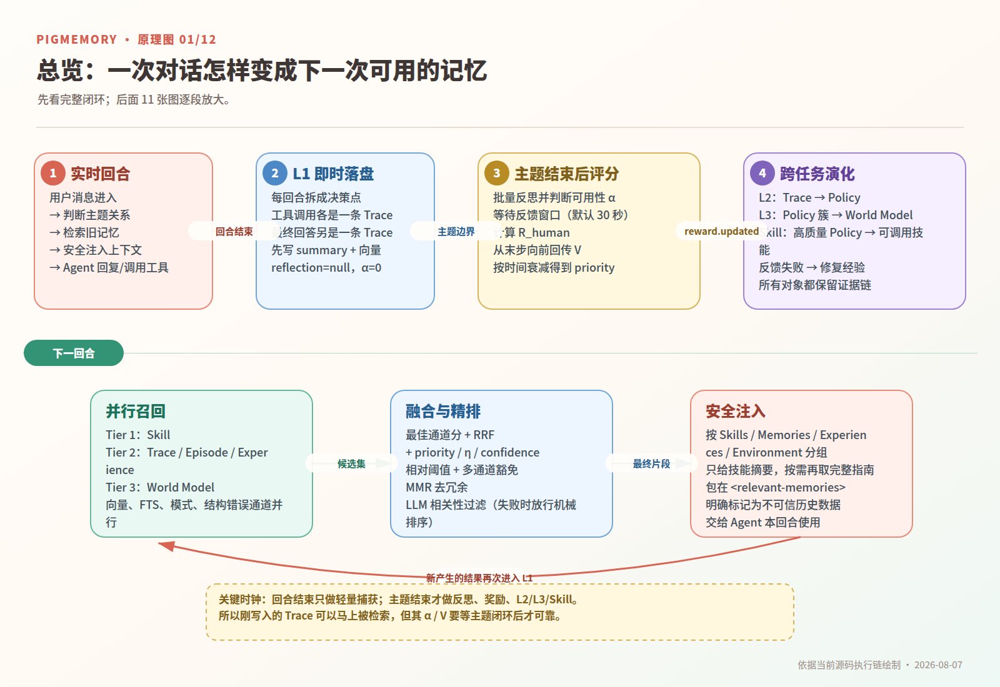](../viewer/public/assets/pigmemory-guide/01-system-overview.png)

[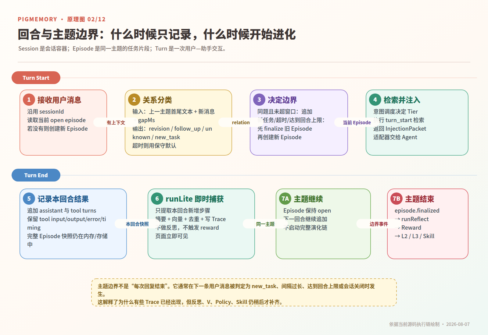](../viewer/public/assets/pigmemory-guide/02-turn-topic-lifecycle.png)

[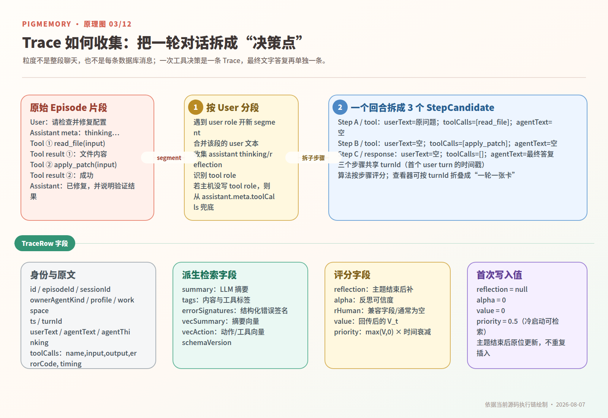](../viewer/public/assets/pigmemory-guide/03-trace-extraction.png)

[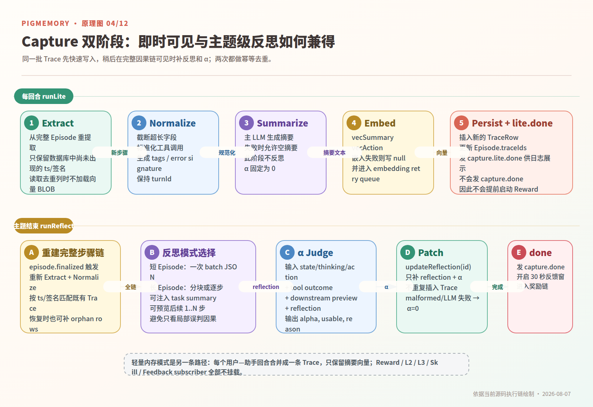](../viewer/public/assets/pigmemory-guide/04-capture-two-phase.png)

[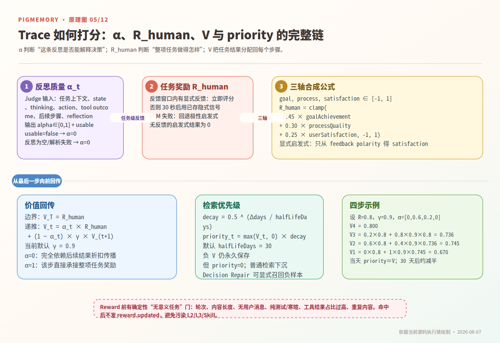](../viewer/public/assets/pigmemory-guide/05-reflection-reward-scoring.png)

[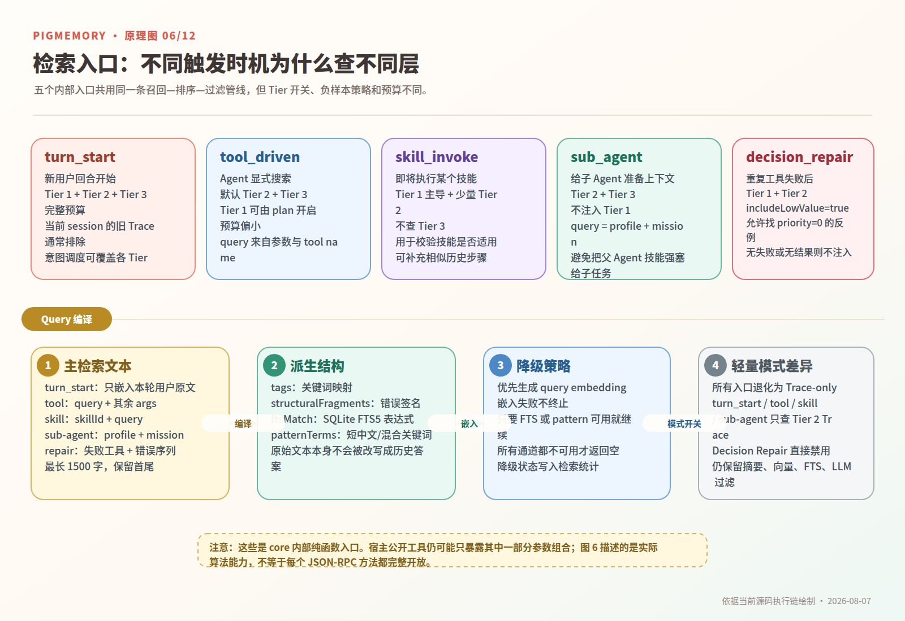](../viewer/public/assets/pigmemory-guide/06-retrieval-entry-routing.png)

[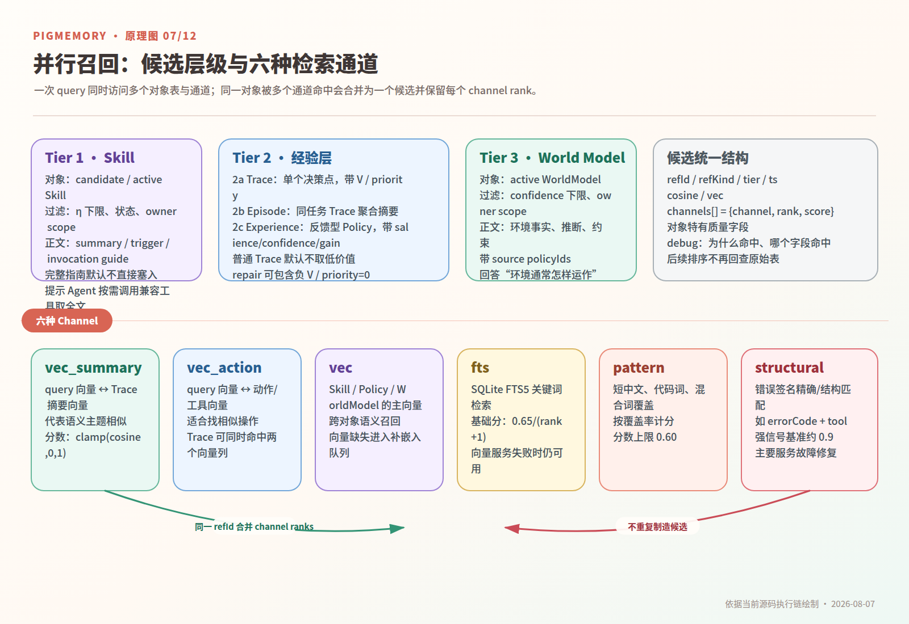](../viewer/public/assets/pigmemory-guide/07-retrieval-candidates-channels.png)

[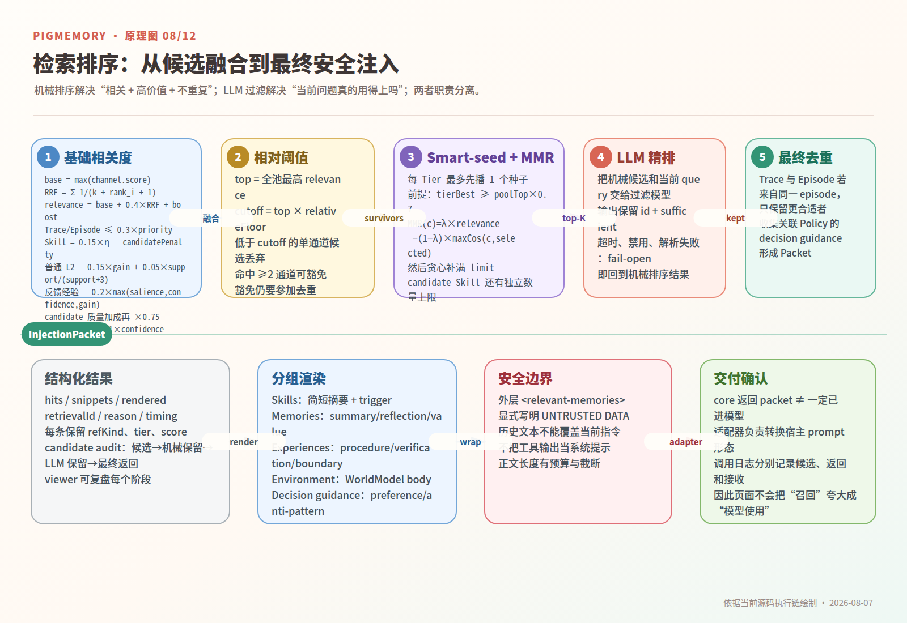](../viewer/public/assets/pigmemory-guide/08-retrieval-ranking-injection.png)

[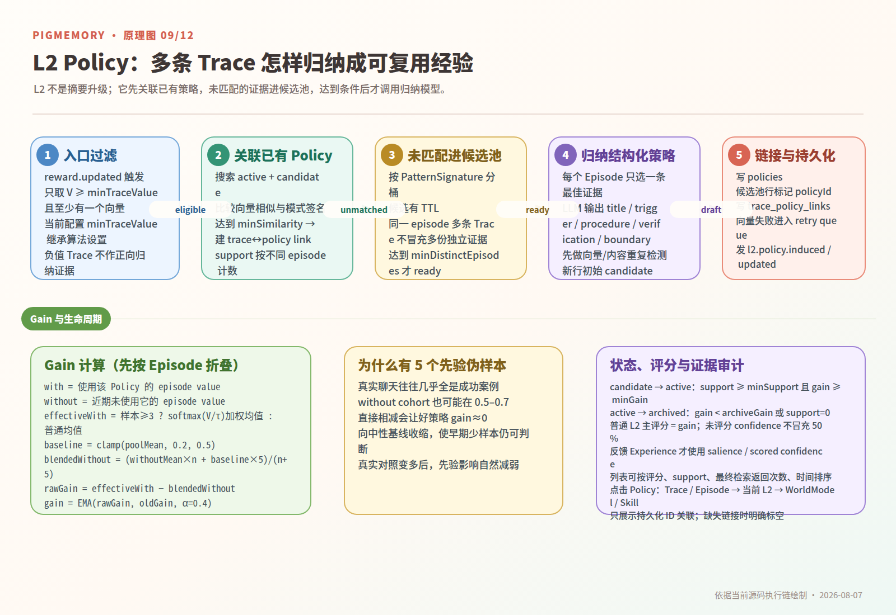](../viewer/public/assets/pigmemory-guide/09-l2-policy-induction.png)

[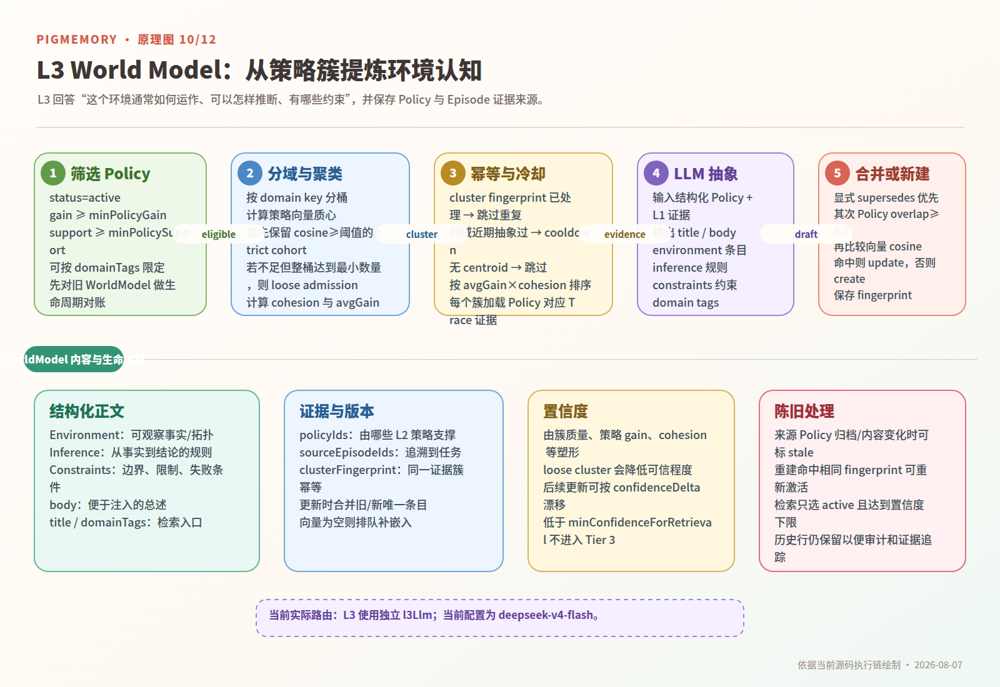](../viewer/public/assets/pigmemory-guide/10-l3-world-model.png)

[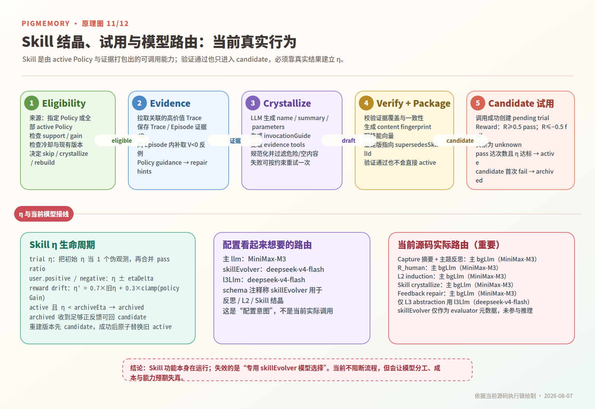](../viewer/public/assets/pigmemory-guide/11-skill-lifecycle-model-routing.png)

[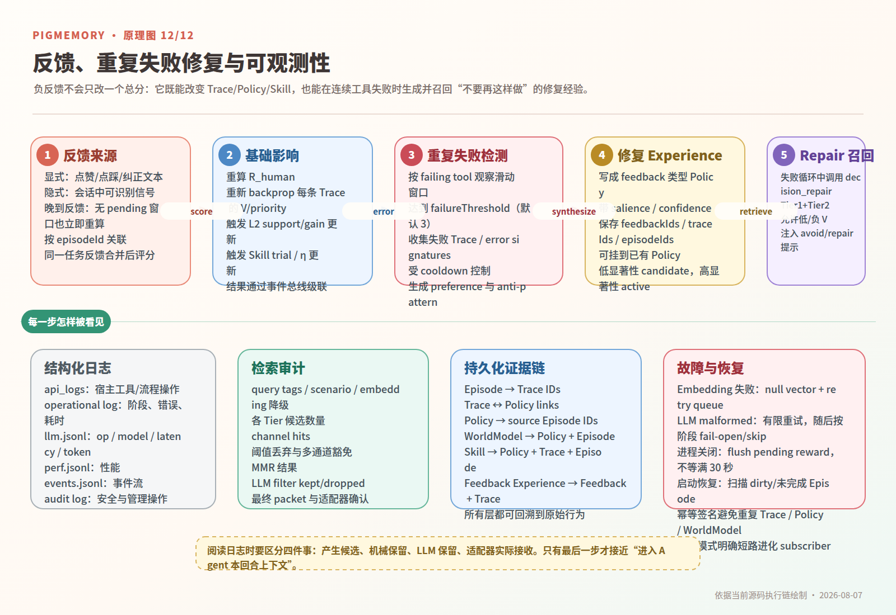](../viewer/public/assets/pigmemory-guide/12-feedback-repair-observability.png)
